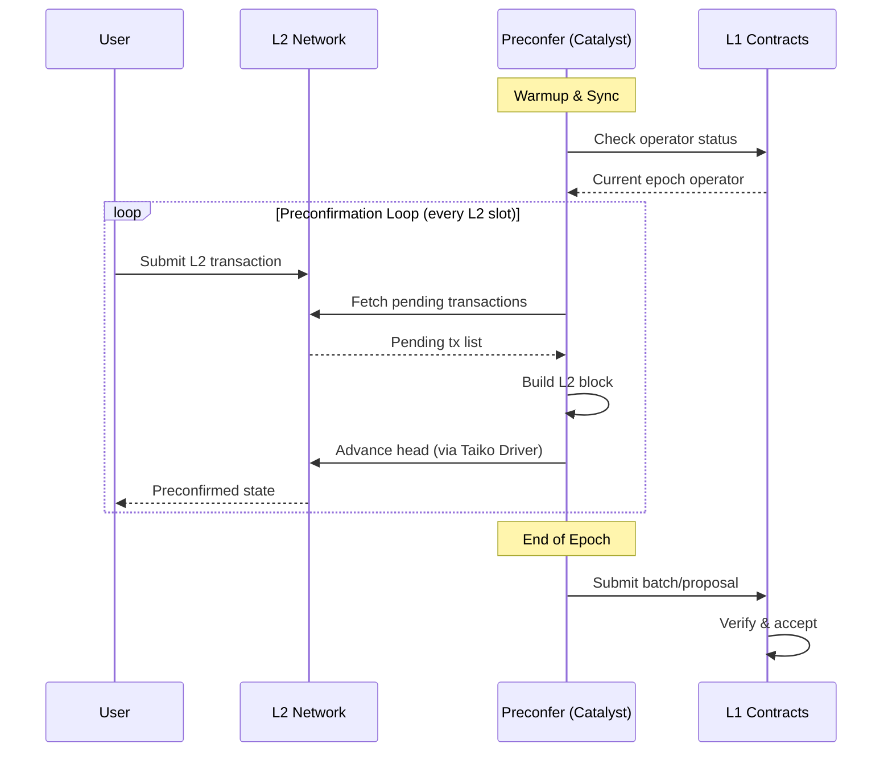
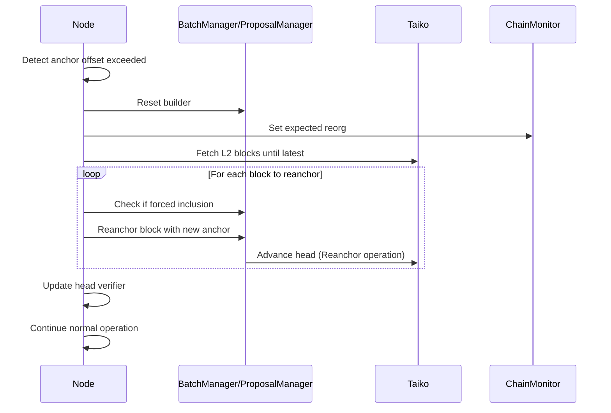

# [Design Doc] Taiko Pacaya & Shasta Preconfirmation Protocol

# Introduction

This document outlines the design and architecture of the Pacaya and Shasta crates within Catalyst, Nethermind's implementation of Taiko's preconfirmation protocol. These crates represent two generations of Taiko's based preconfirmation system:

- **Pacaya**: The initial production version of whitelisted preconfirmations, utilizing batch-based L2 block proposals with the TaikoInbox contract.
- **Shasta**: The next evolution of the preconfirmation protocol, introducing proposal-based L2 block management with enhanced timestamp validation and the Shasta Inbox contract.

Both protocols enable preconfers (elected L1 proposers) to build, sign, and publish Taiko L2 blocks before L1 inclusion, providing users with fast transaction confirmations (~2 seconds) rather than waiting for L1 block finalization (~12 seconds).

# Overview

At a high level, both protocols work as follows:

- Each L1 epoch, a whitelisted operator is elected to be the preconfer for that epoch.
- The preconfer builds L2 blocks at regular intervals (L2 slots, typically 2 seconds).
- L2 blocks are grouped and submitted to L1 as batches (Pacaya) or proposals (Shasta).
- Forced inclusion transactions from L1 must be honored by the preconfer.
- At the end of the epoch, handover occurs to the next operator.

## The Preconfirmation Lifecycle



# Architecture Overview

## Component Hierarchy

```
┌─────────────────────────────────────────────────────────────────────────┐
│                              Main Entry                                  │
│                    (create_pacaya_node / create_shasta_node)            │
└───────────────────────────────┬─────────────────────────────────────────┘
                                │
        ┌───────────────────────┼───────────────────────┐
        │                       │                       │
        ▼                       ▼                       ▼
┌───────────────┐       ┌───────────────┐       ┌───────────────┐
│     Node      │       │   EthereumL1  │       │     Taiko     │
│  (Orchestrator)│       │   (L1 Layer)  │       │  (L2 Layer)   │
└───────┬───────┘       └───────┬───────┘       └───────┬───────┘
        │                       │                       │
        ▼                       ▼                       ▼
┌───────────────┐       ┌───────────────┐       ┌───────────────┐
│ BatchManager/ │       │ExecutionLayer │       │L2ExecutionLayer│
│ProposalManager│       │   + Contracts │       │  + TaikoDriver│
└───────────────┘       └───────────────┘       └───────────────┘
```

## Shared Components

Both Pacaya and Shasta share these core components from the `common` crate:

| Component | Description |
|-----------|-------------|
| `EthereumL1` | L1 Ethereum client wrapper with slot clock |
| `SlotClock` | Manages L1/L2 slot timing and epoch boundaries |
| `TaikoDriver` | Communicates with taiko-driver for block building |
| `L2Engine` | Fetches pending transactions from L2 execution layer |
| `TransactionMonitor` | Monitors L1 transaction submission and confirmation |
| `FundsController` | Manages preconfer funds and bridging |
| `Metrics` | Prometheus metrics collection |

# Pacaya Protocol

## Overview

Pacaya is the batch-based preconfirmation protocol where L2 blocks are grouped into batches and submitted to the TaikoInbox contract on L1.

## Key Components

### Node (`pacaya/src/node/mod.rs`)

The central orchestrator that manages the preconfirmation lifecycle:

```rust
pub struct Node {
    cancel_token: CancellationToken,
    ethereum_l1: Arc<EthereumL1<ExecutionLayer>>,
    chain_monitor: Arc<PacayaChainMonitor>,
    operator: Operator<ExecutionLayer, RealClock, TaikoDriver>,
    batch_manager: BatchManager,
    verifier: Option<Verifier>,
    taiko: Arc<Taiko>,
    transaction_error_channel: Receiver<TransactionError>,
    metrics: Arc<Metrics>,
    watchdog: Watchdog,
    head_verifier: HeadVerifier,
    config: NodeConfig,
    fork_info: ForkInfo,
}
```

**Key Responsibilities:**
- Execute the preconfirmation loop at L2 slot intervals
- Coordinate between L1 and L2 layers
- Handle operator status transitions
- Manage batch submission timing
- Handle reanchoring when anchor offsets become invalid
- Verify L2 head consistency

### BatchManager (`pacaya/src/node/batch_manager/mod.rs`)

Manages the creation and submission of L2 block batches:

```rust
pub struct BatchManager {
    batch_builder: BatchBuilder,
    ethereum_l1: Arc<EthereumL1<ExecutionLayer>>,
    taiko: Arc<Taiko>,
    l1_height_lag: u64,
    forced_inclusion: Arc<ForcedInclusion>,
    metrics: Arc<Metrics>,
    cancel_token: CancellationToken,
}
```

**Key Responsibilities:**
- Create L2 blocks from pending transactions
- Group blocks into batches respecting size limits
- Handle forced inclusion transactions
- Calculate anchor block IDs
- Submit batches to L1 via TaikoInbox

### Operator (`pacaya/src/node/operator/mod.rs`)

Determines the preconfer's status for the current epoch:

```rust
pub struct Operator<T: PreconfOperator, U: Clock, V: StatusProvider> {
    execution_layer: Arc<T>,
    slot_clock: Arc<SlotClock<U>>,
    taiko: Arc<V>,
    handover_window_slots: u64,
    handover_start_buffer_ms: u64,
    next_operator: bool,
    continuing_role: bool,
    // ... additional state
}
```

**Status Determination:**
- `is_current_operator`: Check if we're the elected operator for this epoch
- `is_preconfer`: Can we build L2 blocks now?
- `is_submitter`: Can we submit batches to L1?
- `is_handover_window`: Are we in the epoch handover period?
- `is_end_of_sequencing`: Should we mark the last block with EOS flag?

### ExecutionLayer (L1) (`pacaya/src/l1/execution_layer.rs`)

Handles all L1 contract interactions:

```rust
pub struct ExecutionLayer {
    common: ExecutionLayerCommon,
    provider: DynProvider,
    config: EthereumL1Config,
    taiko_wrapper_contract: TaikoWrapper::TaikoWrapperInstance<DynProvider>,
    transaction_monitor: TransactionMonitor,
    metrics: Arc<Metrics>,
    operators_cache: OperatorsCache,
}
```

**Key Contracts:**
- `TaikoInbox`: Receives proposed L2 batches
- `TaikoWrapper`: Wrapper contract for preconf operations
- `PreconfRouter`: Routes preconfirmation submissions
- `PreconfWhitelist`: Manages whitelisted operators
- `ForcedInclusionStore`: Stores forced inclusion requests

### ProtocolConfig (`pacaya/src/l1/protocol_config.rs`)

Pacaya-specific protocol parameters:

```rust
pub struct ProtocolConfig {
    base_fee_config: BaseFeeConfig,
    max_blocks_per_batch: u16,      // Maximum L2 blocks per batch
    max_anchor_height_offset: u64,   // Maximum L1 block anchor offset
    block_max_gas_limit: u32,        // Maximum gas per L2 block
}
```

## Pacaya Data Flow

### Batch Structure

```
┌─────────────────────────────────────────────────────────────────┐
│                           Batch                                  │
├─────────────────────────────────────────────────────────────────┤
│  Anchor Block ID: L1 block height for anchor transaction        │
│  Coinbase: Fee recipient address                                │
│  Last Block Timestamp: Timestamp of last L2 block               │
├─────────────────────────────────────────────────────────────────┤
│  ┌─────────────┐  ┌─────────────┐  ┌─────────────┐              │
│  │   Block 1   │  │   Block 2   │  │   Block N   │              │
│  ├─────────────┤  ├─────────────┤  ├─────────────┤              │
│  │ numTxs: u16 │  │ numTxs: u16 │  │ numTxs: u16 │              │
│  │ timeShift:u8│  │ timeShift:u8│  │ timeShift:u8│              │
│  │ signalSlots │  │ signalSlots │  │ signalSlots │              │
│  └─────────────┘  └─────────────┘  └─────────────┘              │
├─────────────────────────────────────────────────────────────────┤
│  Compressed Transaction List (all blocks concatenated)          │
└─────────────────────────────────────────────────────────────────┘
```

### L1 Submission

```rust
// BatchParams structure for L1 submission
struct BatchParams {
    proposer: Address,
    coinbase: Address,
    anchorBlockId: u64,
    lastBlockTimestamp: u64,
    revertIfNotFirstProposal: bool,
    // For forced inclusion
    blobCreatedIn: u64,
    blobByteOffset: u32,
    blobByteSize: u32,
    blobIndex: u8,
}

struct BlockParams {
    numTransactions: u16,
    timeShift: u8,
    signalSlots: Vec<SignalSlot>,
}
```

# Shasta Protocol

## Overview

Shasta is the next evolution of the preconfirmation protocol, introducing proposal-based L2 block management with enhanced features:

- **Proposal IDs**: Each submission has a unique proposal ID for tracking
- **Timestamp Validation**: Stricter timestamp offset constraints
- **Gas Limit Flexibility**: Per-block gas limits without anchor overhead
- **Enhanced Manifest Format**: Uses `DerivationSourceManifest` for efficient encoding

## Key Components

### Node (`shasta/src/node/mod.rs`)

Similar to Pacaya but with proposal-focused logic:

```rust
pub struct Node {
    config: NodeConfig,
    cancel_token: CancellationToken,
    ethereum_l1: Arc<EthereumL1<ExecutionLayer>>,
    taiko: Arc<Taiko>,
    watchdog: Watchdog,
    operator: Operator<ExecutionLayer, RealClock, TaikoDriver>,
    metrics: Arc<Metrics>,
    proposal_manager: ProposalManager,
    verifier: Option<Verifier>,
    head_verifier: HeadVerifier,
    transaction_error_channel: Receiver<TransactionError>,
    chain_monitor: Arc<ShastaChainMonitor>,
    last_safe_l2_block_finder: Arc<LastSafeL2BlockFinder>,
}
```

**Key Differences from Pacaya:**
- Uses `ProposalManager` instead of `BatchManager`
- Includes `LastSafeL2BlockFinder` for safe block detection
- Activation timestamp check before operations

### ProposalManager (`shasta/src/node/proposal_manager/mod.rs`)

Manages proposal-based L2 block submissions:

```rust
pub struct ProposalManager {
    batch_builder: BatchBuilder,
    ethereum_l1: Arc<EthereumL1<ExecutionLayer>>,
    taiko: Arc<Taiko>,
    block_advancer: Arc<dyn BlockAdvancer>,
    l1_height_lag: u64,
    min_anchor_offset: u64,
    forced_inclusion: ForcedInclusion,
    metrics: Arc<Metrics>,
    cancel_token: CancellationToken,
    max_blocks_to_reanchor: u64,
    propose_forced_inclusion: bool,
}
```

**Key Differences from BatchManager:**
- Manages proposal IDs for tracking
- Uses `BlockAdvancer` trait for flexible block advancement
- Validates both anchor offset and timestamp offset
- Supports configurable max blocks to reanchor

### Proposal Structure (`shasta/src/node/proposal_manager/proposal.rs`)

```rust
pub struct Proposal {
    pub id: u64,                        // Unique proposal ID
    pub l2_blocks: Vec<L2BlockV2>,      // L2 blocks with enhanced metadata
    pub total_bytes: u64,
    pub coinbase: Address,
    pub anchor_block_id: u64,
    pub anchor_block_timestamp_sec: u64,
    pub anchor_block_hash: B256,
    pub anchor_state_root: B256,
    pub num_forced_inclusion: u16,
    pub created_at_sec: u64,
}
```

### L2BlockV2 Structure

```rust
pub struct L2BlockV2 {
    pub prebuilt_tx_list: PreBuiltTxList,
    pub timestamp_sec: u64,
    pub coinbase: Address,
    pub anchor_block_number: u64,
    pub gas_limit_without_anchor: u64,  // Excludes anchor tx gas
}
```

### BlockAdvancer (`shasta/src/node/proposal_manager/block_advancer.rs`)

Abstraction for advancing L2 head:

```rust
pub trait BlockAdvancer: Send + Sync {
    async fn advance_head_to_new_l2_block(
        &self,
        payload: L2BlockV2Payload,
        l2_slot_context: &L2SlotContext,
        operation_type: OperationType,
    ) -> Result<BuildPreconfBlockResponse, Error>;
}
```

### ProtocolConfig (`shasta/src/l1/protocol_config.rs`)

Shasta-specific protocol parameters:

```rust
pub struct ProtocolConfig {
    basefee_sharing_pctg: u8,
    max_anchor_offset: u64,      // From constants: MAX_ANCHOR_OFFSET
    timestamp_max_offset: u64,   // From constants: TIMESTAMP_MAX_OFFSET
}
```

### LastSafeL2BlockFinder (`shasta/src/node/last_safe_l2_block_finder/mod.rs`)

Finds the last safe (finalized) L2 block through binary search:

```rust
pub struct LastSafeL2BlockFinder {
    ethereum_l1: Arc<EthereumL1<ExecutionLayer>>,
    taiko: Arc<Taiko>,
}
```

## Shasta Data Flow

### Proposal Manifest Format

```
┌─────────────────────────────────────────────────────────────────┐
│                    DerivationSourceManifest                      │
├─────────────────────────────────────────────────────────────────┤
│  ┌─────────────────────────────────────────────────────────┐    │
│  │                    BlockManifest[0]                      │    │
│  ├─────────────────────────────────────────────────────────┤    │
│  │  timestamp: u64                                          │    │
│  │  coinbase: Address                                       │    │
│  │  anchor_block_number: u64                                │    │
│  │  gas_limit: u64                                          │    │
│  │  transactions: Vec<TransactionEnvelope>                  │    │
│  └─────────────────────────────────────────────────────────┘    │
│  ┌─────────────────────────────────────────────────────────┐    │
│  │                    BlockManifest[N]                      │    │
│  │                        ...                               │    │
│  └─────────────────────────────────────────────────────────┘    │
└─────────────────────────────────────────────────────────────────┘
                              │
                              ▼
                    encode_and_compress()
                              │
                              ▼
                    Compressed blob data
```

### L2BlockV2Payload

Payload sent to the Taiko driver for block advancement:

```rust
pub struct L2BlockV2Payload {
    pub proposal_id: u64,
    pub coinbase: Address,
    pub tx_list: Vec<Transaction>,
    pub timestamp_sec: u64,
    pub gas_limit_without_anchor: u64,
    pub anchor_block_id: u64,
    pub anchor_block_hash: B256,
    pub anchor_state_root: B256,
    pub is_forced_inclusion: bool,
}
```

# Forced Inclusion

Both protocols support forced inclusion - a mechanism ensuring that L1-submitted transactions must be included in L2 blocks within a specific timeframe.

## Pacaya Forced Inclusion (`pacaya/src/forced_inclusion/mod.rs`)

```rust
pub struct ForcedInclusionInfo {
    pub blob_hash: B256,
    pub blob_byte_offset: u32,
    pub blob_byte_size: u32,
    pub created_in: u64,
    pub txs: Vec<Transaction>,
}
```

**Flow:**
1. User submits forced inclusion request to L1 `ForcedInclusionStore`
2. Preconfer monitors the store's head/tail pointers
3. When processing, preconfer reads blob data and extracts transactions
4. Forced inclusion block is created with special handling

## Shasta Forced Inclusion (`shasta/src/forced_inclusion/mod.rs`)

```rust
// Uses DerivationSourceManifest for blob parsing
pub struct ForcedInclusion {
    ethereum_l1: Arc<EthereumL1<ExecutionLayer>>,
    index: u64,
}
```

**Differences from Pacaya:**
- Uses `DerivationSourceManifest::decompress_and_decode()` for parsing
- Returns `Vec<Transaction>` directly instead of `ForcedInclusionInfo`
- Non-atomic index (mutable reference vs AtomicU64)

# Operator Election & Handover

## Epoch-Based Rotation

```
┌─────────────────────────────────────────────────────────────────┐
│                         L1 Epoch (32 slots)                      │
├────────────────────────────────────────────┬────────────────────┤
│           Active Preconfirmation           │  Handover Window   │
│              (Slots 0-29)                  │   (Slots 30-31)    │
├────────────────────────────────────────────┼────────────────────┤
│  • Operator A preconfirms                  │ • Operator A       │
│  • Operator A submits batches              │   completes work   │
│  • Normal L2 block production              │ • Operator B       │
│                                            │   prepares to      │
│                                            │   take over        │
└────────────────────────────────────────────┴────────────────────┘
```

## Operator Status Checks

```python
def get_operator_status(l2_slot_info):
    # 1. Check if preconf router is configured
    if not is_preconf_router_specified():
        return Status(preconfer=False, submitter=False)

    # 2. Check if we're the current epoch operator
    current_operator = is_current_operator(epoch)

    # 3. Check handover window status
    handover_window = is_handover_window(l1_slot)

    # 4. Determine preconfer status
    if handover_window:
        preconfer = next_operator and (was_synced or not handover_buffer)
    else:
        preconfer = current_operator

    # 5. Check driver synchronization
    is_driver_synced = check_geth_driver_sync(l2_slot_info)

    # 6. Determine submitter status
    submitter = current_operator and not (handover_window and simulate_not_submitting)

    # 7. Check end of sequencing
    end_of_sequencing = (not continuing_role and preconfer
                         and submitter and slot_before_handover)

    return Status(preconfer, submitter, is_driver_synced, end_of_sequencing)
```

# Reanchoring

When anchor offsets become invalid (L1 progresses too far), blocks must be reanchored:

## Reanchoring Flow



## Shasta-Specific Reanchoring

Shasta adds validation for both anchor offset and timestamp offset:

```rust
pub fn is_offsets_valid(&self, anchor_block_offset: u64, timestamp_offset: u64) -> bool {
    self.is_anchor_block_offset_valid(anchor_block_offset)
        && self.is_timestamp_offset_valid(timestamp_offset)
}
```

# Comparison: Pacaya vs Shasta

| Feature | Pacaya | Shasta |
|---------|--------|--------|
| **Block Grouping** | Batches | Proposals with IDs |
| **L1 Contract** | TaikoInbox | Shasta Inbox |
| **Manifest Format** | BatchParams + BlockParams | DerivationSourceManifest |
| **Gas Limit** | Global block max | Per-block (without anchor) |
| **Timestamp Validation** | Anchor offset only | Anchor + timestamp offset |
| **Block Structure** | L2Block | L2BlockV2 |
| **Slot Info** | L2SlotInfo | L2SlotInfoV2 |
| **Forced Inclusion Index** | AtomicU64 | Mutable u64 |
| **Safe Block Finding** | Via TaikoInbox.getBatch() | Binary search via LastSafeL2BlockFinder |
| **Activation** | Immediate | Activation timestamp check |

## Protocol Config Differences

**Pacaya:**
```rust
struct ProtocolConfig {
    base_fee_config: BaseFeeConfig,  // Full base fee configuration
    max_blocks_per_batch: u16,
    max_anchor_height_offset: u64,
    block_max_gas_limit: u32,
}
```

**Shasta:**
```rust
struct ProtocolConfig {
    basefee_sharing_pctg: u8,        // Only sharing percentage
    max_anchor_offset: u64,          // From constants
    timestamp_max_offset: u64,       // New: timestamp validation
}
```

# Transaction Flow

## Complete Transaction Lifecycle

```
┌──────────────────────────────────────────────────────────────────────────┐
│                          User Transaction                                 │
└─────────────────────────────────┬────────────────────────────────────────┘
                                  │
                                  ▼
┌──────────────────────────────────────────────────────────────────────────┐
│                         L2 Mempool (Taiko Geth)                          │
└─────────────────────────────────┬────────────────────────────────────────┘
                                  │
                                  ▼
┌──────────────────────────────────────────────────────────────────────────┐
│                    L2 Engine (get_pending_l2_tx_list)                    │
│  • Filter by base fee                                                     │
│  • Respect gas limits                                                     │
│  • Return PreBuiltTxList                                                  │
└─────────────────────────────────┬────────────────────────────────────────┘
                                  │
                                  ▼
┌──────────────────────────────────────────────────────────────────────────┐
│                  BatchBuilder / ProposalManager                          │
│  • Check if block can be added to current batch                          │
│  • Create new batch if needed                                            │
│  • Calculate anchor block ID                                             │
│  • Add block to batch                                                    │
└─────────────────────────────────┬────────────────────────────────────────┘
                                  │
                                  ▼
┌──────────────────────────────────────────────────────────────────────────┐
│                           Taiko Driver                                    │
│  • Construct anchor transaction                                          │
│  • Build ExecutableData / L2BlockV2Payload                               │
│  • Call preconf_blocks API                                               │
│  • Return BuildPreconfBlockResponse                                      │
└─────────────────────────────────┬────────────────────────────────────────┘
                                  │
                                  ▼
┌──────────────────────────────────────────────────────────────────────────┐
│                      L2 Head Advanced (Preconfirmed)                     │
│  • Users see transaction result                                          │
│  • Block added to unsafe chain                                           │
└─────────────────────────────────┬────────────────────────────────────────┘
                                  │
                        (At epoch end or batch full)
                                  │
                                  ▼
┌──────────────────────────────────────────────────────────────────────────┐
│                         L1 Submission                                     │
│  • Compress transaction list                                             │
│  • Build proposeBatch transaction                                        │
│  • Submit via TransactionMonitor                                         │
└─────────────────────────────────┬────────────────────────────────────────┘
                                  │
                                  ▼
┌──────────────────────────────────────────────────────────────────────────┐
│                    L1 TaikoInbox / Shasta Inbox                          │
│  • Verify preconfer is authorized                                        │
│  • Accept batch/proposal                                                 │
│  • Emit event                                                            │
└─────────────────────────────────┬────────────────────────────────────────┘
                                  │
                                  ▼
┌──────────────────────────────────────────────────────────────────────────┐
│                          Transaction Finalized                           │
│  • Block becomes part of safe chain                                      │
│  • Can be proven and verified                                            │
└──────────────────────────────────────────────────────────────────────────┘
```

# Error Handling

Both protocols handle various transaction errors:

```rust
pub enum TransactionError {
    ReanchorRequired,           // Need to rebuild blocks with new anchor
    NotConfirmed,               // Transaction not confirmed in time
    UnsupportedTransactionType, // Invalid tx type
    GetBlockNumberFailed,       // L1 RPC failure
    EstimationTooEarly,         // Submitted too early in L1 slot
    InsufficientFunds,          // Not enough funds for bonds
    EstimationFailed,           // Gas estimation failed
    TransactionReverted,        // Transaction reverted on L1
    OldestForcedInclusionDue,   // Must include forced inclusion
    NotTheOperatorInCurrentEpoch, // Submitted after epoch ended
}
```

# Metrics

Both protocols expose Prometheus metrics:

- `block_tx_count`: Transactions per L2 block
- `batch_info`: Batch size and byte count
- `blocks_reanchored`: Number of blocks reanchored
- `critical_errors`: Critical error count
- L1 transaction timing metrics

# Configuration

## Pacaya Configuration

```rust
pub struct NodeConfig {
    pub preconf_heartbeat_ms: u64,      // L2 slot duration
    pub handover_window_slots: u64,     // Slots for handover
    pub handover_start_buffer_ms: u64,  // Buffer before handover
    pub l1_height_lag: u64,             // L1 blocks behind for anchor
    pub propose_forced_inclusion: bool, // Enable forced inclusion
    pub simulate_not_submitting_at_the_end_of_epoch: bool, // Testing flag
    pub watchdog_max_counter: u64,      // Max failures before shutdown
}
```

## Shasta Configuration

```rust
pub struct NodeConfig {
    // Same as Pacaya, plus:
    pub min_anchor_offset: u64,         // Minimum anchor offset
    pub max_blocks_to_reanchor: u64,    // Max blocks in reanchor
}
```

# Evolution: From Pacaya/Shasta to Permissionless

This section compares the whitelisted preconfirmation protocols (Pacaya/Shasta) with the upcoming permissionless design, explaining the architectural evolution and the rationale behind design decisions.

## The Seven Steps: Comparative Analysis

The permissionless design identifies seven fundamental steps for preconfirmations. Here's how Pacaya/Shasta implement each step differently:

### Step 1: Registration

| Aspect | Pacaya/Shasta (Whitelisted) | Permissionless |
|--------|----------------------------|----------------|
| **Mechanism** | `PreconfWhitelist` contract with admin-managed operator list | Universal Registration Contract (URC) with BLS key registration |
| **Collateral** | Implicit trust in whitelisted entities | Explicit collateral locked in URC |
| **Onboarding** | Admin adds operator address to whitelist | Operator self-registers with BLS keys + collateral |
| **Key Management** | Single ECDSA address per operator | BLS keys mapped to registration roots |

**Pacaya/Shasta Implementation:**
```rust
// OperatorsCache queries PreconfWhitelist contract
impl WhitelistProvider for ExecutionLayer {
    async fn is_operator_whitelisted(&self) -> Result<bool, Error> {
        let contract = PreconfWhitelist::new(
            self.contract_addresses.proposer_checker,
            &self.provider,
        );
        let operators = contract
            .operators(self.common().preconfer_address())
            .call()
            .await?;
        Ok(operators.activeSince > 0)
    }
}
```

**Why This Design Choice:**
- **Simplicity**: Whitelist is straightforward to implement and audit
- **Control**: Allows Taiko to vet operators during early protocol stages
- **Risk Mitigation**: Limits exposure while preconfirmation infrastructure matures
- **No Slashing Complexity**: Avoids complex slashing logic during initial deployment

### Step 2: Election

| Aspect | Pacaya/Shasta (Whitelisted) | Permissionless |
|--------|----------------------------|----------------|
| **Selection** | Round-robin epoch-based rotation among whitelisted operators | Lookahead-based mapping from L1 proposer schedule |
| **Lookahead** | None - next operator known from whitelist order | Optimistic lookahead submission by first preconfer of epoch |
| **Granularity** | Entire epoch assigned to one operator | Per-slot assignment based on L1 proposer |
| **Fallback** | Next whitelisted operator | Whitelist-based fallback preconfer |

**Pacaya/Shasta Implementation:**
```rust
// Operator election via epoch-based rotation
async fn is_current_operator(&mut self, epoch: u64) -> Result<bool, Error> {
    match self.execution_layer
        .get_operators_for_current_and_next_epoch(
            self.slot_clock.get_epoch_begin_timestamp(epoch)?,
            self.slot_clock.get_current_slot_begin_timestamp()?,
        ).await
    {
        Ok((current_operator_address, next_operator_address)) => {
            let current_operator =
                current_operator_address == self.execution_layer.get_preconfer_address();
            self.next_operator =
                next_operator_address == self.execution_layer.get_preconfer_address();
            Ok(current_operator)
        }
        // ...
    }
}
```

**Why This Design Choice:**
- **Predictability**: Operators know their schedule in advance
- **Simplicity**: No complex lookahead management or fraud proofs
- **Coordination**: Handover is well-defined at epoch boundaries
- **Liveness**: Always has an operator available (no gaps from opt-out)

### Step 3: Request Submission

| Aspect | Pacaya/Shasta | Permissionless |
|--------|---------------|----------------|
| **Channel** | Standard Taiko L2 mempool | Same + potential private channels with delegation |
| **Prioritization** | L2 priority fees | Same |
| **Forced Inclusion** | L1 ForcedInclusionStore | Same mechanism |

**Implementation is identical** - both use the existing Taiko mempool infrastructure.

### Step 4: Preconfirmation Publication

| Aspect | Pacaya/Shasta (Whitelisted) | Permissionless |
|--------|----------------------------|----------------|
| **Publication Method** | Direct execution via Taiko Driver | P2P network broadcast of signed `Preconfirmation` objects |
| **Commitment Format** | Implicit (block is built and executed) | Explicit `SignedCommitment` with slasher address |
| **EOP Signaling** | `end_of_sequencing` flag in driver call | Explicit `eop=true` in final `Preconfirmation` |
| **Verification** | Trust in whitelisted operator | Cryptographic signatures verified by network |

**Pacaya/Shasta Implementation:**
```rust
// Direct block advancement via Taiko Driver
pub async fn advance_head_to_new_l2_block(
    &self,
    l2_block: L2Block,
    anchor_origin_height: u64,
    anchor_block_state_root: B256,
    l2_slot_info: &L2SlotInfo,
    end_of_sequencing: bool,  // Implicit EOP
    is_forced_inclusion: bool,
    operation_type: OperationType,
) -> Result<BuildPreconfBlockResponse, Error> {
    // Build ExecutableData and call driver
    self.driver.preconf_blocks(request_body, operation_type).await
}
```

**Permissionless Preconfirmation Structure:**
```solidity
struct Preconfirmation {
    bool eop;                       // Explicit end-of-preconfirmation
    uint256 blockNumber;
    uint256 timestamp;
    uint256 gasLimit;
    address coinbase;
    uint256 anchorBlockNumber;
    bytes32 rawTxListHash;          // Commitment to tx list
    bytes32 parentPreconfirmationHash;
    uint256 submissionWindowEnd;
    address proverAuth;
    uint256 proposalId;
}
```

**Why This Design Choice:**
- **Performance**: Direct execution is faster than P2P broadcast + verification
- **Simplicity**: No P2P network infrastructure to maintain
- **Trust Model**: Whitelisted operators are already trusted entities
- **Iteration Speed**: Easier to update and debug without P2P complexity

### Step 5: Preconfirmation Reception

| Aspect | Pacaya/Shasta | Permissionless |
|--------|---------------|----------------|
| **State Update** | Direct via Taiko Driver API | Subscribe to P2P, verify signature, execute |
| **Latency** | Immediate (driver executes directly) | Network propagation + verification delay |
| **Trust Model** | Trust driver + whitelisted operator | Cryptographic verification |

### Step 6: L1 Inclusion

| Aspect | Pacaya/Shasta (Whitelisted) | Permissionless |
|--------|----------------------------|----------------|
| **Submission Method** | Direct transaction to Inbox contract | Via constraints API, builder APIs, or mempool |
| **Authorization** | Whitelist check in contract | Lookahead verification |
| **Timing** | Any time during epoch (typically at end) | Before `submissionWindowEnd` |
| **Format** | Compressed batches/proposals | Same format with additional slashing metadata |

**Pacaya Implementation:**
```rust
pub async fn send_batch_to_l1(
    &self,
    batch: Batch,
) -> Result<(), Error> {
    let tx = self.construct_propose_batch_tx(batch).await?;
    self.transaction_monitor
        .monitor_new_transaction(tx, pending_nonce)
        .await
}
```

**Why This Design Choice:**
- **Direct Submission**: Whitelisted operators can submit directly without builder intermediation
- **Flexibility**: Can submit at optimal times within epoch
- **Cost Efficiency**: No need for constraints API complexity

### Step 7: Slashing (Not Implemented in Pacaya/Shasta)

| Aspect | Pacaya/Shasta | Permissionless |
|--------|---------------|----------------|
| **Equivocation Slashing** | ❌ Not implemented | ✅ Slash if preconfed != submitted |
| **Lookahead Slashing** | ❌ N/A (no lookahead) | ✅ Slash for invalid lookahead submission |
| **EOP Violations** | ❌ Not implemented | ✅ Slash for missing EOP or post-EOP preconfs |
| **Collateral** | ❌ No collateral | ✅ URC-managed collateral |
| **Dispute Resolution** | Manual/admin | Cryptographic fraud proofs |

**Why No Slashing in Pacaya/Shasta:**
- **Trust Assumption**: Whitelisted operators have reputation at stake
- **Simplicity**: Slashing requires complex fraud proof infrastructure
- **Iteration**: Can add slashing in future versions without protocol breaks
- **Social Accountability**: Misbehaving operators can be removed from whitelist

## Architecture Comparison

### Component Mapping

```
┌─────────────────────────────────────────────────────────────────────────────┐
│                         PACAYA/SHASTA                                        │
├─────────────────────────────────────────────────────────────────────────────┤
│                                                                             │
│  ┌─────────────┐    ┌─────────────────┐    ┌─────────────────────────┐     │
│  │PreconfWhite-│    │  OperatorsCache │    │    Operator Module      │     │
│  │   list      │───▶│  (epoch-based)  │───▶│  (status determination) │     │
│  └─────────────┘    └─────────────────┘    └─────────────────────────┘     │
│         │                                              │                    │
│         ▼                                              ▼                    │
│  ┌─────────────┐                            ┌─────────────────────────┐     │
│  │TaikoWrapper │                            │   BatchManager /        │     │
│  │PreconfRouter│                            │   ProposalManager       │     │
│  └─────────────┘                            └─────────────────────────┘     │
│         │                                              │                    │
│         ▼                                              ▼                    │
│  ┌─────────────┐                            ┌─────────────────────────┐     │
│  │ TaikoInbox/ │◀───────────────────────────│     Taiko Driver        │     │
│  │ Shasta Inbox│  (direct submission)       │  (direct execution)     │     │
│  └─────────────┘                            └─────────────────────────┘     │
│                                                                             │
└─────────────────────────────────────────────────────────────────────────────┘

                                    ▼▼▼
                            EVOLUTION TO
                                    ▼▼▼

┌─────────────────────────────────────────────────────────────────────────────┐
│                         PERMISSIONLESS                                       │
├─────────────────────────────────────────────────────────────────────────────┤
│                                                                             │
│  ┌─────────────┐    ┌─────────────────┐    ┌─────────────────────────┐     │
│  │     URC     │    │  URC Indexer    │    │    Lookahead Store      │     │
│  │(registration│───▶│ (BLS mapping)   │───▶│   (preconfer schedule)  │     │
│  │+ collateral)│    └─────────────────┘    └─────────────────────────┘     │
│  └─────────────┘                                       │                    │
│         │                                              ▼                    │
│         ▼                                   ┌─────────────────────────┐     │
│  ┌─────────────┐                            │   Preconf Sidecar       │     │
│  │  Slashing   │                            │  (P2P + commitments)    │     │
│  │  Contracts  │                            └─────────────────────────┘     │
│  └─────────────┘                                       │                    │
│         ▲                                              ▼                    │
│         │                                   ┌─────────────────────────┐     │
│  ┌─────────────┐                            │    Preconf P2P          │     │
│  │  Disputer   │◀───────────────────────────│   (signed preconfs)     │     │
│  │  (fraud     │  (equivocation detection)  └─────────────────────────┘     │
│  │   proofs)   │                                       │                    │
│  └─────────────┘                                       ▼                    │
│                                             ┌─────────────────────────┐     │
│                                             │  Constraints API /      │     │
│                                             │  Builder APIs           │     │
│                                             └─────────────────────────┘     │
│                                                                             │
└─────────────────────────────────────────────────────────────────────────────┘
```

### Key Architectural Differences

| Component | Pacaya/Shasta | Permissionless | Evolution Rationale |
|-----------|---------------|----------------|---------------------|
| **Registration** | PreconfWhitelist | URC | From admin control to self-sovereign registration |
| **Identity** | ECDSA address | BLS keys + registration root | Support for L1 proposer verification |
| **Scheduling** | OperatorsCache | Lookahead Store + Indexer | From static rotation to dynamic proposer mapping |
| **Publication** | Direct driver calls | P2P network | From trusted execution to verifiable commitments |
| **L1 Submission** | Direct to Inbox | Constraints API / Builders | From privileged access to permissionless submission |
| **Safety** | Trust + forced inclusion | Slashing + fraud proofs | From social trust to cryptographic guarantees |
| **Fallback** | Next whitelisted operator | Fallback preconfer pool | Similar but with collateral requirements |

## Design Decision Rationale

### Why Whitelisted First?

1. **De-risking**: Test preconfirmation infrastructure without economic attack vectors
2. **Iteration Speed**: Faster development without slashing complexity
3. **Trust Building**: Establish relationships with reliable operators
4. **Protocol Stability**: Ensure base protocol works before adding complexity
5. **User Protection**: Limit blast radius of potential bugs

### Why Epoch-Based vs Slot-Based Election?

**Pacaya/Shasta (Epoch-Based):**
- One operator per epoch (32 slots = ~6.4 minutes)
- Simpler handover coordination
- Lower coordination overhead
- Works well with small operator set

**Permissionless (Slot-Based):**
- Maps to L1 proposer schedule
- Maximizes decentralization
- Requires complex lookahead management
- Necessary for true permissionless design

### Why No P2P Network?

**Pacaya/Shasta Decision:**
- Direct execution is faster and simpler
- Trusted operators don't need public commitments
- Reduces infrastructure complexity
- Easier debugging and monitoring

**Trade-offs:**
- Users must trust the operator
- No cryptographic proof of commitment
- Equivocation detection is harder

### Why No Slashing?

**Pacaya/Shasta Decision:**
- Reputation suffices for whitelisted operators
- Slashing requires fraud proof infrastructure
- Simpler to iterate without economic penalties
- Can be added in future versions

**Trade-offs:**
- Relies on operator reputation
- No economic punishment for misbehavior
- Must manually remove bad operators

## Migration Path

### From Pacaya to Shasta

```
Pacaya ──────────────────────────────────────▶ Shasta
  │                                               │
  │  • Batch-based                                │  • Proposal-based
  │  • L2Block                                    │  • L2BlockV2
  │  • TaikoInbox                                 │  • Shasta Inbox
  │  • Single max gas limit                       │  • Per-block gas limits
  │                                               │  • Timestamp validation
  │                                               │
  └───────────────────────────────────────────────┘
        Shared: Operator module, SlotClock,
                ForcedInclusion, Handover logic
```

### From Shasta to Permissionless

```
Shasta ─────────────────────────────────────▶ Permissionless
  │                                               │
  │  Components to Add:                           │
  │  ┌─────────────────────────────────────────┐  │
  │  │ • URC integration                       │  │
  │  │ • BLS key management                    │  │
  │  │ • Lookahead Store                       │  │
  │  │ • URC Indexer                           │  │
  │  │ • Preconf P2P network                   │  │
  │  │ • SignedCommitment generation           │  │
  │  │ • Slashing contract integration         │  │
  │  │ • Fraud proof submission                │  │
  │  │ • Constraints API / Builder integration │  │
  │  └─────────────────────────────────────────┘  │
  │                                               │
  │  Components to Modify:                        │
  │  ┌─────────────────────────────────────────┐  │
  │  │ • Operator module → Lookahead-based     │  │
  │  │ • ProposalManager → + P2P publication   │  │
  │  │ • ExecutionLayer → + URC queries        │  │
  │  │ • Node → + Sidecar coordination         │  │
  │  └─────────────────────────────────────────┘  │
  │                                               │
  │  Components Reusable:                         │
  │  ┌─────────────────────────────────────────┐  │
  │  │ • SlotClock (with modifications)        │  │
  │  │ • ForcedInclusion                       │  │
  │  │ • L2 execution layer                    │  │
  │  │ • Transaction monitoring                │  │
  │  │ • Metrics infrastructure                │  │
  │  └─────────────────────────────────────────┘  │
  │                                               │
  └───────────────────────────────────────────────┘
```

## Feature Comparison Matrix

| Feature | Pacaya | Shasta | Permissionless |
|---------|--------|--------|----------------|
| **Decentralization** | ⭐⭐ (whitelisted set) | ⭐⭐ (whitelisted set) | ⭐⭐⭐⭐⭐ (any L1 proposer) |
| **Trust Requirements** | ⭐⭐⭐ (trust operators) | ⭐⭐⭐ (trust operators) | ⭐⭐⭐⭐⭐ (cryptographic) |
| **Complexity** | ⭐⭐ (simple) | ⭐⭐⭐ (moderate) | ⭐⭐⭐⭐⭐ (complex) |
| **Slashing** | ❌ | ❌ | ✅ Full slashing suite |
| **P2P Network** | ❌ | ❌ | ✅ Required |
| **URC Integration** | ❌ | ❌ | ✅ Required |
| **Lookahead** | ❌ | ❌ | ✅ Required |
| **Forced Inclusion** | ✅ | ✅ | ✅ |
| **Fast Preconfs** | ✅ (~2s) | ✅ (~2s) | ✅ (~2s) |
| **Production Ready** | ✅ | ✅ | 🚧 In development |

## Summary: The Evolution Story

```
┌─────────────────────────────────────────────────────────────────────────────┐
│                     TAIKO PRECONFIRMATION EVOLUTION                          │
├─────────────────────────────────────────────────────────────────────────────┤
│                                                                             │
│  Phase 1: PACAYA (Production)                                               │
│  ════════════════════════════                                               │
│  • Whitelisted operators                                                    │
│  • Batch-based L2 blocks                                                    │
│  • Direct execution model                                                   │
│  • No slashing, trust-based                                                 │
│  • Goal: Prove preconf infrastructure works                                 │
│                                                                             │
│                              ▼                                              │
│                                                                             │
│  Phase 2: SHASTA (Production)                                               │
│  ════════════════════════════                                               │
│  • Still whitelisted                                                        │
│  • Proposal-based with IDs                                                  │
│  • Enhanced validation (timestamp offset)                                   │
│  • Per-block gas limits                                                     │
│  • Goal: Refine protocol, prepare for permissionless                        │
│                                                                             │
│                              ▼                                              │
│                                                                             │
│  Phase 3: PERMISSIONLESS (Planned)                                          │
│  ═════════════════════════════════                                          │
│  • Any L1 proposer can participate                                          │
│  • URC registration + collateral                                            │
│  • Lookahead-based election                                                 │
│  • P2P preconfirmation network                                              │
│  • Full slashing suite                                                      │
│  • Goal: True decentralization                                              │
│                                                                             │
└─────────────────────────────────────────────────────────────────────────────┘
```

The evolution from Pacaya → Shasta → Permissionless follows a deliberate strategy:

1. **Start Simple**: Pacaya proves the core preconfirmation loop works
2. **Refine Protocol**: Shasta adds features needed for permissionless (proposal IDs, timestamp validation)
3. **Add Decentralization**: Permissionless removes the whitelist and adds cryptographic guarantees

This incremental approach allows Taiko to:
- Ship value to users quickly (fast preconfs since Pacaya)
- Battle-test infrastructure before adding complexity
- Build operator relationships and expertise
- Migrate smoothly without breaking changes

# Conclusion

Pacaya and Shasta represent the foundational phases of Taiko's preconfirmation journey:

- **Pacaya** established the core preconfirmation infrastructure with batch-based submission, proving that based preconfirmations work in production
- **Shasta** refined the protocol with proposal-based management, timestamp validation, and enhanced block structures, laying groundwork for permissionless

The progression to permissionless preconfirmations will add:
- URC-based registration replacing the whitelist
- Lookahead-based election replacing epoch rotation
- P2P publication replacing direct execution
- Cryptographic slashing replacing social trust

This evolutionary approach ensures Taiko delivers fast preconfirmations today while building toward a fully decentralized future.
